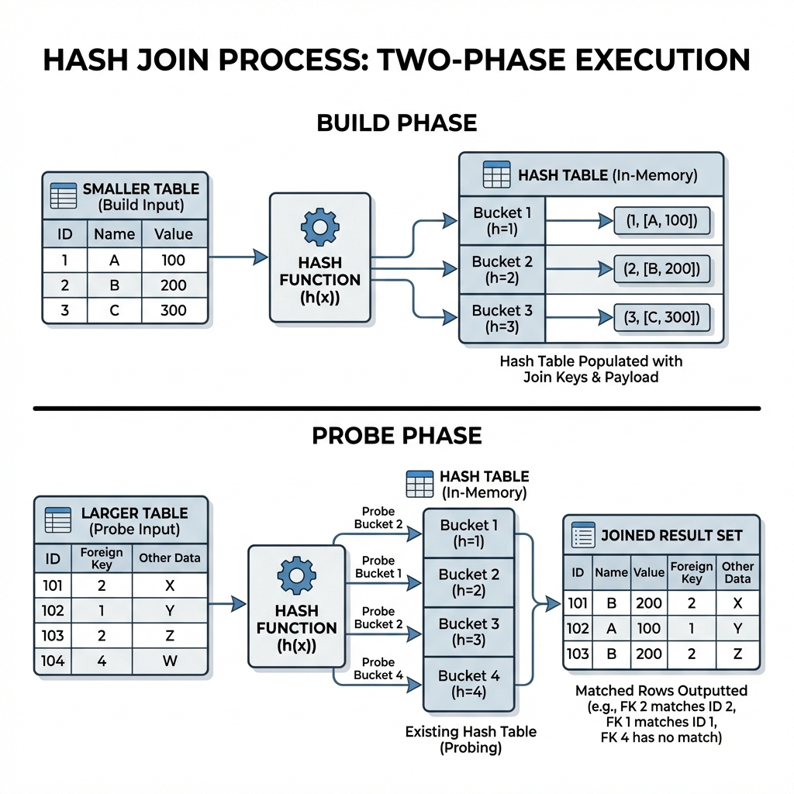

# 조인의 원리 (Join Principles)

## ✨ 학습 주제
- 과목: Database
- 주제: Join Principles

## 📄 학습 내용 요약

조인을 수행할 때 데이터베이스가 내부적으로 사용하는 알고리즘입니다.

### 1. 중첩 루프 조인 (Nested Loop Join)
*   **개념:** 이중 for문과 같은 원리로 동작합니다. 외부 테이블(Driving Table)의 각 행에 대해 내부 테이블(Driven Table)을 순차적으로 검색합니다.
*   **동작 원리 예시:**
    ```text
    // Table A (학생): 100명, Table B (학과): 10개
    for (rowA in TableA) {           // 외부 루프 (100회)
        for (rowB in TableB) {       // 내부 루프 (매번 10회 스캔)
            if (rowA.dept_id == rowB.id) {
                return (rowA, rowB); // 매칭 성공
            }
        }
    }
    ```
    *   총 100 * 10 = 1,000번의 비교가 일어납니다.
    *   인덱스가 있다면 내부 루프에서 스캔을 하지 않고 검색할 수 있어 성능이 향상됩니다.

### 2. 정렬 병합 조인 (Sort Merge Join)
*   **개념:** 각 테이블을 조인 키(Join Key)를 기준으로 정렬(Sort)한 후, 정렬된 데이터를 병합(Merge)하면서 조인을 수행합니다.
*   **동작 원리 예시:**
    ```text
    Table A (정렬됨): [1, 3, 5, 7]
    Table B (정렬됨): [1, 2, 5, 8]
    
    1. A(1) vs B(1): 일치! (반환) -> 둘 다 다음으로 이동
    2. A(3) vs B(2): 2 < 3 이므로, B 포인터 이동
    3. A(3) vs B(5): 3 < 5 이므로, A 포인터 이동
    4. A(5) vs B(5): 일치! (반환) -> ...
    ```
    *   데이터 양이 많고 인덱스가 없을 때 유리합니다.

### 3. 해시 조인 (Hash Join)
*   **개념:** 해시 테이블을 사용하여 조인을 수행합니다. 대용량 데이터 처리에 유리하며 등가 조인(=)에서만 사용 가능합니다.
*   
*   **1단계: 빌드 (Build Phase)**
    *   두 테이블 중 **작은 테이블**을 읽어 해시 테이블(Hash Table)을 생성합니다. (메모리에 적재)
    *   예: `학과` 테이블을 읽어 `학과ID`를 키로 하는 해시 맵 생성.
*   **2단계: 프로브 (Probe Phase)**
    *   **큰 테이블**을 순차적으로 읽으면서, 각 행의 조인 키를 해시 함수에 넣어 해시 테이블에 값이 존재하는지 확인(Probing)합니다.
    *   해시 충돌이 발생하지 않는다면 O(1)의 속도로 데이터를 찾을 수 있습니다.

## 🔍 추가 학습 필요사항
> 학습하면서 부족하다고 느낀 점, 더 깊게 공부하고 싶은 내용을 작성해주세요.
- 각 조인 방식의 구체적인 성능 차이와 튜닝 포인트에 대해 더 알아보고 싶습니다.
