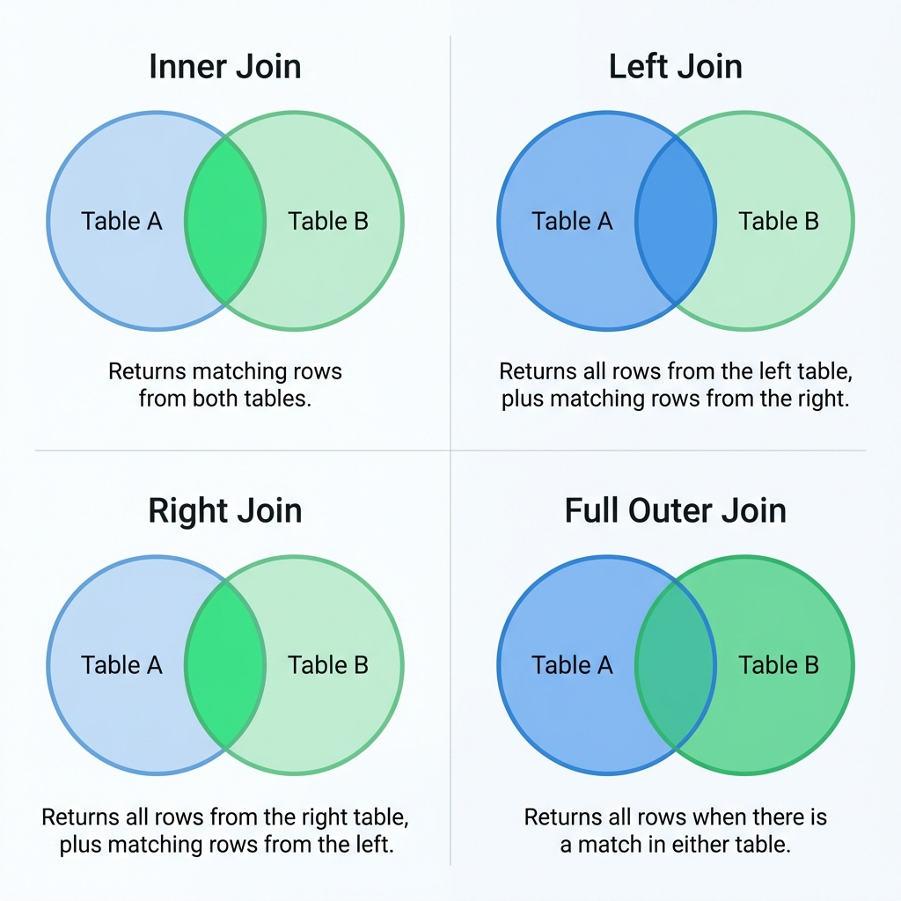

# 조인의 종류 (Join Types)

## ✨ 학습 주제
- 과목: Database
- 주제: Join Types

## 📄 학습 내용 요약

조인(Join)은 두 개 이상의 테이블을 묶어서 하나의 결과 집합으로 만들어내는 것을 의미합니다.

*   **내부 조인 (Inner Join):**
    *   두 테이블 간에 교집합(Common)되는 데이터만 추출합니다.
    *   조인 조건에 일치하는 행만 반환됩니다.
*   **왼쪽 조인 (Left Outer Join):**
    *   왼쪽 테이블의 모든 행을 결과에 포함하고, 오른쪽 테이블에서 일치하는 행이 있으면 가져옵니다.
    *   일치하지 않는 경우 오른쪽 테이블의 컬럼은 NULL로 채워집니다.
*   **오른쪽 조인 (Right Outer Join):**
    *   오른쪽 테이블의 모든 행을 결과에 포함하고, 왼쪽 테이블에서 일치하는 행이 있으면 가져옵니다.
    *   일치하지 않는 경우 왼쪽 테이블의 컬럼은 NULL로 채워집니다.
*   **합집합 조인 (Full Outer Join):**
    *   왼쪽 및 오른쪽 테이블의 모든 행을 포함합니다.
    *   일치하지 않는 부분은 양쪽 모두 NULL로 채워집니다.

### 3. 실무 적용 예시 (TeeNOW 프로젝트)
TeeNOW(골프 부킹/조인 플랫폼)에서 실제로 조인이 어떻게 사용될 수 있는지 알아봅시다.

*   **내부 조인 (Inner Join) 활용:**
    *   **상황:** "내 예약 목록 보여줘."
    *   **설명:** `회원(Member)` 테이블과 `예약(Reservation)` 테이블을 조인하여, **실제로 예약이 있는 회원**의 정보만 가져옵니다. 예약하지 않은 회원은 결과에 나오지 않습니다.
    *   `SELECT * FROM Member M INNER JOIN Reservation R ON M.id = R.member_id`

*   **왼쪽 조인 (Left Outer Join) 활용:**
    *   **상황:** "모든 골프장 리스트와, 만약 내일 예약이 있다면 예약 정보도 보여줘."
    *   **설명:** `골프장(GolfCourse)` 테이블을 기준으로 `예약(Reservation)` 테이블을 조인합니다. 예약이 없는 골프장도 목록에 모두 표시되어야 하므로 Left Join이 적합합니다.
    *   `SELECT * FROM GolfCourse G LEFT JOIN Reservation R ON G.id = R.course_id AND R.date = 'Tomorrow'`

*   **조인(Join) 매칭 시스템:**
    *   **상황:** "조인 요청(JoinRequest)과 대기 중인 골퍼(Golfer) 매칭"
    *   **설명:** `조인요청` 테이블과 `골퍼` 테이블을 조인하여 조건(핸디캡, 선호 지역 등)이 맞는 데이터를 찾아 매칭 리스트를 생성합니다. 이때 인덱스를 활용한 **Nested Loop Join**이 효율적일 수 있습니다.

## 🔍 추가 학습 필요사항
> 학습하면서 부족하다고 느낀 점, 더 깊게 공부하고 싶은 내용을 작성해주세요.
