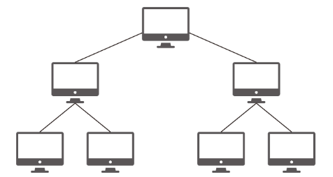
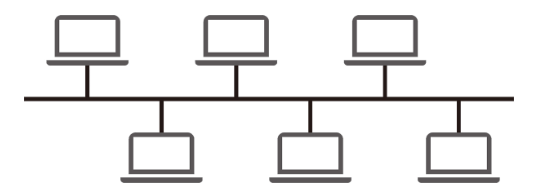
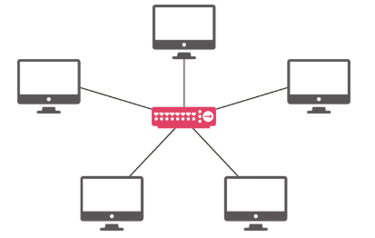
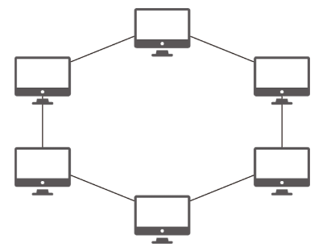
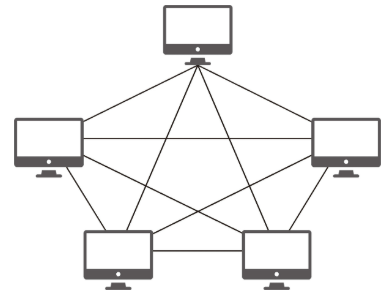

## ✨ 학습 주제

- 과목: 네트워크
- 주제: 데이터베이스의 기초

## 📄 학습 내용 요약

### 0. 개요
- 네트워크의 정의
    - 노드와 링크가 서로 연결되어 리소스를 공유하는 집합
    - **노드**는 서버, 라우터, 스위치 등 장치
    - **링크**는 유선 or 무선 연결

### 1. 처리량과 지연시간
- 처리량(throughput)
    - 정의: 링크에서 성공적으로 처리된 데이터의 양
    - 단위: bps
    - 트래픽과 처리량의 차이
        - 트래픽은 링크 내의 데이터의 양이고, 처리량은 노드에 전달되어 성공적으로 처리된 데이터의 양
    - 대역폭: 일정 시간 동안 네트워크 연결을 통해 흐를 수 있는 최대 비트 수

- 지연시간(latency)
    - 정의: 요청이 처리되는 시간, 즉 메시지가 두 장치를 **왕복**하는데 걸리는 시간
    - 매체 타입(유선, 무선)과 네트워크 장치의 성능에 따라 달라짐

### 2. 네트워크 토폴로지와 병목 현상
- 네트워크 토폴로지
    - 정의: 노드와 링크가 배치된 방식과 형태
    1. 트리 토폴로지  
        - 
        - 트리 형태
        - 특정 노드에 트래픽이 집중될 때 하위 노드에 영향을 끼침
    2. 버스 토폴로지
        - 
        - 중앙 회선에 여러 노드가 연결된 형태
        - LAN에서 사용된다.
        - 비용이 적고 신뢰성이 높다.
        - 스푸핑 위험이 있음
    3. 스타 토폴로지
        - 
        - 중앙에 있는 노드에 모두 연결된 형태
        - 장애 발생 시 에러 탐지가 쉽다.
        - 패킷 충돌 가능성이 적다.
        - 중앙 노드에 장애 발생하면 망함; 설치 비용도 비싸다
    4. 링형 토폴로지
        - 
        - 링 형태
        - 노드가 많아도 네트워크상의 손실이 적고 충돌 가능성이 낮음
        - 네트워크 구성이 어렵고 회선이 하나라도 망가지면 조짐
    5. 메시 토폴로지
        - 
        - 그물 형태
        - 단말에 장애가 발생해도 괜찮음
        - 운영과 구축 비용이 크다.
        - 노드 추가가 어렵다.

- 병목 현상
    - 정의: 전체 시스템이 하나의 구성 요소로 인해 제한을 받는 현상
    - 병목 현상 해결 시 토폴로지가 중요한 기준이 된다.

### 3. 네트워크 분류
    - LAN(Local Area Network)
        - 근거리 통신망. 같은 건물이나 캠퍼스 내에서 운영
        - 전송 속도 빠름, 혼잡하지 않음
    - MAN(Metropolitan Network)
        - 도시 규모에서 운용
        - 전송 속도 중간, 혼잡도 중간
    - WAN(Wide Area Network)
        - 국가 또는 대륙 규모에서 운용
        - 전송 속도 느림, 혼잡도 높음

### 4. 네트워크 성능 분석 명령어
    - 네트워크 병목 현상의 주 원인
        - 네트워크 대역폭
        - 네트워크 토폴로지
        - 서버 CPU, 메모리 사용량
        - 비효율적인 네트워크 구성

    - 병목 현상 발생 시 관련 명령어
        - ping
            - 해당 노드까지 네트워크가 잘 연결되어 있는지 확인
            - ICMP 프로토콜을 지원하지 않거나 차단한 대상으로는 테스트 불가
        - netstat
            - 접속되어 있는 서비스들의 네트워크 상태를 출력
            - 네트워크 접속, 라우팅 테이블, 네트워크 프로토콜 리스트 등을 출력
            - 주로 서비스의 포트가 열려 있는지 확인
        - nslookup
            - DNS에 관련된 내용을 확인하기 위해 사용
            - 특정 도메인에 매핑된 IP를 확인
        - tracert (리눅스: traceroute)
            - 목적지까지의 네트워크 경로를 확인할 때 사용
            - 어느 구간에서 느려지는지 등 확인 가능

## 🔍 추가 학습 필요사항
- 2.1.2의 토폴로지나 2.1.3의 네트워크 분류보다는 2.1.2의 병목현상과 2.1.4의 명령어를 중점적으로 깊게 공부하는 게 좋을 것 같습니다. 책에 나온 4개의 명령어는 매우매우 자주 사용되므로 여러 쓰임새와 옵션을 찾아보면 좋습니다.

## 문제 및 예상 질문
- 특정 시간 동안 발생한 트래픽이 같은 시간 동안 처리된 처리량보다 많을 수 있나요?
- 대역폭 크기보다 많은 트래픽이 발생하면 어떻게 되나요?