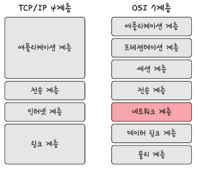
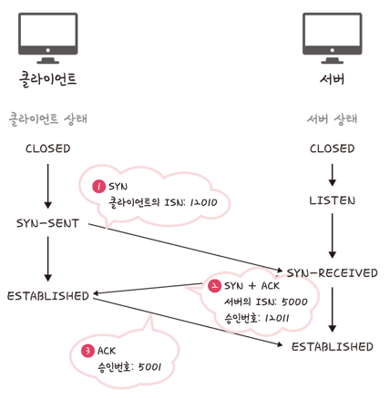
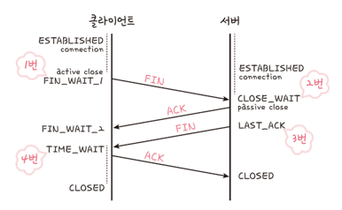
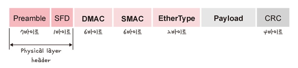
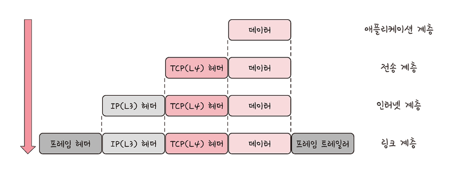
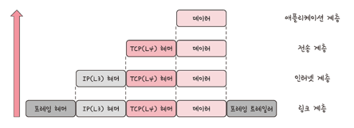

- TCP/IP 4계층 모델은 네 개의 계층을 가지고 있으며 OSI 7계층과 많이 비교됨
- OSI 7계층은 애플리케이션 계층을 세 개로 쪼개로 링크 계층을 데이터 링크, 물리 계층으로 표현하는 것
- 그리고 인터넷 계층은 네트워크 계층으로 부른다는 점이 다름

### 애플리케이션 계층

- 애플리케이션(application) 계층은 FTP, HTTP, SSH, SMTP, DNS 등 응용 프로그램이 사용되는 프로토콜 계층
- 웹 서비스, 이메일 등 서비스를 실질적으로 사람들에게 제공

| 프로토콜 | 설명                                                    |
| :--- |:------------------------------------------------------|
| **FTP** | 장치와 장치 간의 파일을 전송하는 데 사용되는 표준 통신 프로토콜                  |
| **SSH** | 보안되지 않은 네트워크에서 네트워크 서비스를 안전하게 운영하기 위한 암호화 네트워크 프로토콜   |
| **HTTP** | World Wide Web을 위한 데이터 통신의 기초이자 웹 사이트를 이용하는 데 쓰는 프로토콜 |
| **SMTP** | 전자 메일 전송을 위한 인터넷 표준 통신 프로토콜                           |
| **DNS** | 도메인 이름과 IP 주소를 매핑해주는 서버                               |

### 전송 계층

- 전송(transport) 게층은 송신자와 수신자를 연결하는 통신 서비스를 제공하여 연결지향 데이터 스트림 지원, 신뢰성, 흐름 제어 제공
- TCP
  - 패킷 사이의 순서를 보장하고 연결지향 프로토콜을 사용하여 연결하여 신뢰성을 구축
  - 가상회선 패킷 교환 방식 사용
- UDP
  - 순서를 보장하지 않고 수신여부를 확인하지 않음
  - 데이터그램 패킷 교환 방식 사용

#### 가상회선 패킷 교환 방식

- 각 패킷에 가상회선 식별자가 포함되며 모든 패킷을 전송하면 가상회선이 해제되고
- 패킷들은 순서대로 도착하는 방식

#### 데이터그램 패킷 교환 방식

- 패킷이 독립적으로 이동하며 최적의 경로를 선택
- 하나의 메시지에서 분할된 여러 패킷이 서로 다른 경로로 전송될 수 있으면 도착한 순서가 다를 수 있는 방식

#### TCP 연결 성립 과정

1. SYN 단계
   - 클라이언트는 서버에 클라이언트의 ISN(Initial Sequence Number)을 담아 SYN을 보냄
   - ISN은 TCP 연결에서 첫 번째 패킷에 할당된 임의의 시퀀스 번호
2. SYN + ACK 단계
   - 서버가 클라이언트의 SYN을 수신하고 서버의 ISN을 보내며
   - 승인번호로 클라이언트의 ISN + 1을 보냄
3. ACK 단계
   - 클라이언트는 서버의 ISN + 1한 값인 승인번호를 담아 ACK를 서버에 보냄

#### TCP 연결 해제 과정

1. FIN 단계
   - 클라이언트가 연결을 닫으려고 할때 FIN으로 설정된 세그먼트를 보냄
   - 클라이언트는 FIN_WAIT_1 상태로 들어가고 서버의 응답을 기다림
2. ACK 단계
   - 서버는 클라이언트로 ACK라는 승인 세그먼트를 보냄
   - 서버는 CLOSE_WAIT 상태로 들어가고 클라이언트는 FIN_WAIT_2 상태로 들어감
3. FIN 단계
   - 서버는 ACK를 보내고 일정 시간 이후에
   - 클라이언트에게 FIN 세그먼트를 보냄
4. ACK 단계
   - 클라이언트는 TIME_WAIT 상태가 되고 다시 서버로 ACK를 보내 CLOSED 상태가 됨
   - 어느 정도의 시간을 대기한 후 연결을 닫고 모든 자원의 연결을 해제
     - 지연 패킷의 발생을 대비하기 위함. 연결이 닫혔는지 확인하기 위해서

### 인터넷 계층

- 인터넷(internet) 계층은 장치로부터 받은 네트워크 패킷을 IP 주소로 지정된 목적지로 전송하기 위해 사용되는 계층
- IP, ARP, ICMP 등이 있으며 패킷을 수신해야 할 상대의 주소를 지정하여 데이터를 전달

### 링크 계층

- 링크 계층은 데이터를 전달하며 장치 간에 신호를 주고받는 규칙을 정하는 계층
- 물리 계층과 데이터 링크 계층으로 나누기도 함
  - 물리 계층: 무선 LAN과 유선 LAN을 통해 0과 1로 이루어진 데이터를 보내는 계층
  - 데이터 링크 계층: 이더넷 프레임을 통해 에러 확인, 흐름 제어, 접근 제어를 담당하는 계층

#### 전이중화 통신

- 전이중화(full duplex) 통신으 양쪽 장치가 동시에 송수신할 수 있는 방식

#### CSMA/CD (Carrier Sense Multiple Access with Collision Detection)

- 데이터를 보낸 이후 충돌이 발생한다면 일정 시간 이후 재전송하는 방식
- 수신로와 송신로가 따로 있는 것이 아닌 한 경로를 기반으로 데이터를 주고받기 때문에 충돌에 대비함

#### 트위스트 페어 케이블/광섬유 케이블

- 트위스트 페어 케이블은 여덟 개의 구리선을 두 개씩 꼬아서 묶은 케이블
- 광섬유 케이블은 광섬유로 만들어져 빛의 반사를 이용해 데이터를 전송하는 케이블

#### 반이중화 통신

- 양쪽 장치는 서로 통신할 수 있지만
- 동시에는 통신할 수 없으며 한 번에 한 방향만 통신할 수 있는 방식

#### CSMA/CA(Carrier Sense Multiple Access with Collision Avoidance)

CSMA/CA로 프레임을 보낼 때 다음과 같은 과정이 일어남
1. 사용 중인 채널이 있다면 다른 채널을 감지하여 유휴 상태인 채널 발견
2. 프레임 간 공간 시간인 IFS(InterFrame Space) 동안 대기
3. 프레임을 보내기 전 랜덤 상수를 기반으로 결정된 시간 k 만큼 기다린 뒤 프레임을 보냄
   - 제대로 송딘되어 ACK 세그먼트를 받으면 마침
   - 받지 못했다면 k = k + 1을 하고 반복
   - k가 정해진 Kmax보다 더 커진다면 해당 프레임전송은 버림 (abort).

#### 와이파이

- 전자기기들이 무선 LAN 신호에 연결할 수 있게 하는 기술
- 무선 접속 장치(AP, Access Point)가 필요. 흔히 공유기라고 함
- 유선 LAN에 흐르는 신호를 무선 LAN 신호로 바꿔주어 신호가 닿는 범위 내에서 무선 인터넷을 사용할 수 있게 함

#### BSS(Basic Service Set)/ESS(Extended Service Set)

- BSS는 기본 서비스 집합으로, 동일 BSS 내에 있는 AP들과 장치들이 서로 통신이 가능한 구조
  - 하나의 AP만을 기반으로 구축되어 있어 자유롭게 이동하며 네트워크에 접속하는 것은 불가능
- ESS는 확장 서비스 집합으로, 여러 BSS들이 모여 하나의 네트워크를 형성하는 구조
  - 장거리 무선 통신을 지원

#### 이더넷 프레임

데이터 링크 계층은 이더넷 프레임을 통해 전달받은 데이터의 에러를 검출하고 캡슐화함

- Preamble: 이더넷 프레임이 시작임을 알림
- SFD(Start Frame Delimiter): 다음 바이트부터 MAC 주소 필드가 시작됨을 알림
- DMAC, SMAC: 수신, 송신 MAC 주소를 말함
- EtherType: 데이터 계층 위의 계층은 IP 프로토콜을 정의 (IPv4 or IPv6)
- Payload: 전달받은 데이터
- CRC: 에러 확인 비트

### 계층 간 데이터 송수신 과정

- 애플리케이션 계층에서 보내는 요청은 캡슐화 과정을 거침
- 링크 계층에서 수신한 데이터는 비캡슐화 과정을 거쳐 데이터가 전송됨

#### 캡슐화 과정

- 상위 계층의 헤더와 데이터를 하위 계층의 데이터 부분에 포함시키고 해당 계층의 헤더를 삽입하는 과정

#### 비캡슐화 과정

- 하위 계층에서 하위 계층으로 가며 각 계층의 헤더를 제거하는 과정

### PDU (Protocol Data Unit)

- 네트워크의 어떠한 계층에서 계층으로 데이터가 전달될 때 한 덩어리의 단위
- 제어 관련 정보들이 포함된 `헤더`, 데이터를 의미하는 `페이로드`로 구성
   - 애플리케이션 계층: 메시지
   - 전송 계층: 세그먼트(TCP), 데이터그램(UDP)
   - 인터넷 계층: 패킷
   - 링크 게층: 프레임(데이터 링크 계층), 비트(물리 계층)

